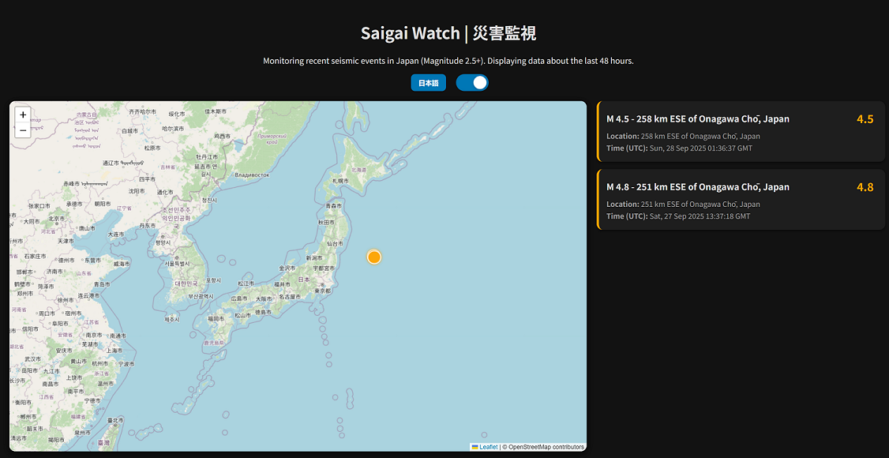

# Saigai Watch

Saigai Watch is a client side, simple seismic activity monitoring dashboard designed to provide real-time information about natural events in Japan.

## Features

- Real-time natural events data aggregation (recent seismic activity data from USGS)
- Interactive map visualization
- Multi-language support

## Live Demo
[https://xenom0rph97.github.io/saigai-watch/](https://xenom0rph97.github.io/saigai-watch/)

## Dashboard Example

## Contributing

Contributions are welcome! Please open issues or submit pull requests.

## License

This project is licensed under the MIT License.
